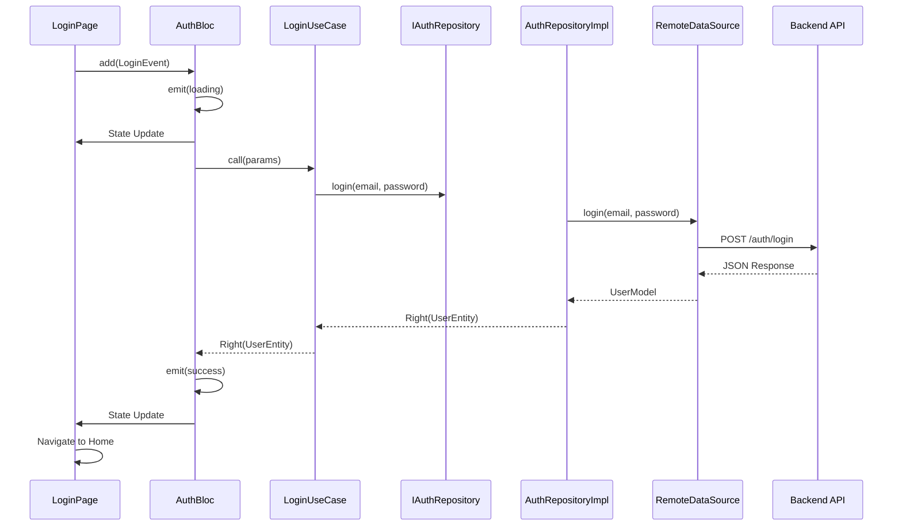

# Flutter Clean Architecture Project

> Enterprise-grade Flutter application built with **MVVM + BLoC + Clean Architecture** following **Feature-First** organization pattern.


---

## MỤC LỤC

- [Giới thiệu về Clean Architecture](#giới-thiệu-về-clean-architecture)
- [3-Layer Architecture](#3-layer-architecture)
- [Feature-First Organization](#feature-first-organization)
- [BLoC Pattern với UseCases](#bloc-pattern-với-usecases)
- [Dependency Injection](#dependency-injection-với-getit)
- [Data Flow](#data-flow-luồng-dữ-liệu)
- [Tech Stack](#tech-stack)
- [Project Structure](#project-structure-chi-tiết)
- [Setup và Installation](#setup-và-installation)

---

## Giới thiệu về Clean Architecture

Clean Architecture là kiến trúc phần mềm được đề xuất bởi Robert C. Martin (Uncle Bob), giúp tạo ra các ứng dụng có:

- **Tính độc lập cao**: Logic nghiệp vụ (Business Logic) hoàn toàn tách biệt khỏi UI, Database và Framework
- **Dễ kiểm thử**: "Testable by Design" - Mọi thành phần đều có thể test độc lập
- **Bảo trì tốt**: Cấu trúc rõ ràng, dễ mở rộng
- **Quy mô lớn**: Phù hợp với team đông người, dự án Enterprise

### Nguyên tắc Phụ thuộc (Dependency Rule)

**Quy tắc bất di bất dịch**: Sự phụ thuộc chỉ đi từ ngoài vào trong.

```
┌─────────────────────────────────────────────────┐
│  Presentation Layer (Outer)                     │
│  ┌───────────────────────────────────────────┐  │
│  │  Data Layer (Middle)                      │  │
│  │  ┌─────────────────────────────────────┐  │  │
│  │  │  Domain Layer (Inner - Core)        │  │  │
│  │  │                                     │  │  │
│  │  │  - Entities                        │  │  │
│  │  │  - Use Cases                       │  │  │
│  │  │  - Repository Interfaces           │  │  │
│  │  │                                     │  │  │
│  │  │  (Pure Business Logic)             │  │  │
│  │  └─────────────────────────────────────┘  │  │
│  │                                            │  │
│  │  - Models, Data Sources                   │  │
│  │  - Repository Implementations             │  │
│  └───────────────────────────────────────────┘  │
│                                                  │
│  - BLoC (ViewModel)                             │
│  - Pages, Widgets                               │
└─────────────────────────────────────────────────┘

   Dependencies flow inward ────────────────────>
```

---

## 3-Layer Architecture

Kiến trúc chia ứng dụng thành 3 tầng rõ ràng, mỗi tầng có trách nhiệm riêng biệt.

### 1. Domain Layer - Lõi Bất biến (The Immutable Core)

**Vai trò**: Chứa "trí tuệ" của ứng dụng. Hoàn toàn độc lập, không phụ thuộc Flutter, UI, Database hay Network.

**Thành phần**:

#### Entities (Thực thể)
- Đại diện cho các đối tượng nghiệp vụ
- Class thuần Dart (POJO), sử dụng `Equatable` cho value equality
- **KHÔNG** chứa logic `fromJson` hay `toJson`
- Bất biến (immutable)

```dart
// ✅ Correct: Entity thuần túy
class ProductEntity extends Equatable {
  final String id;
  final String name;
  final double price;

  const ProductEntity({
    required this.id,
    required this.name,
    required this.price,
  });

  @override
  List<Object?> get props => [id, name, price];
}
```

#### Repository Interfaces
- Định nghĩa ranh giới giữa Domain và Data
- Abstract Class với các phương thức trả về `Future<Either<Failure, Type>>`
- Functional Error Handling thay vì ném Exception

```dart
abstract class IProductRepository {
  Future<Either<Failure, List<ProductEntity>>> getProducts();
  Future<Either<Failure, ProductEntity>> getProductById(String id);
}
```

#### Use Cases (Interactors)
- Đóng gói một hành động nghiệp vụ cụ thể
- Cầu nối giữa Presentation và Domain
- Nhận input từ BLoC, thực thi logic, gọi Repository, trả về kết quả

```dart
class GetProductsUseCase extends UseCase<List<ProductEntity>, NoParams> {
  final IProductRepository repository;

  GetProductsUseCase(this.repository);

  @override
  Future<Either<Failure, List<ProductEntity>>> call(NoParams params) async {
    return await repository.getProducts();
  }
}
```

---

### 2. Data Layer - Cơ sở Hạ tầng (The Infrastructure)

**Vai trò**: Đóng vai trò "người phục vụ" cho Domain Layer. Thay đổi công nghệ chỉ ảnh hưởng lớp này.

**Thành phần**:

#### Models (Data Transfer Objects)
- Mở rộng của Entities
- Chứa logic Serialization/Deserialization (`fromJson`, `toJson`)
- Sử dụng `json_serializable` để tự động hóa

```dart
class ProductModel extends ProductEntity {
  const ProductModel({
    required String id,
    required String name,
    required double price,
  }) : super(id: id, name: name, price: price);

  factory ProductModel.fromJson(Map<String, dynamic> json) => ProductModel(
    id: json['id'],
    name: json['name'],
    price: json['price'].toDouble(),
  );

  Map<String, dynamic> toJson() => {
    'id': id,
    'name': name,
    'price': price,
  };
}
```

#### Data Sources
- **Remote Data Source**: Gọi API (sử dụng Retrofit/Dio)
- **Local Data Source**: Cache/Database (Hive/Isar/SharedPreferences)
- Bắt và ném các Exception kỹ thuật

```dart
abstract class ProductRemoteDataSource {
  Future<List<ProductModel>> getProducts();
}

class ProductRemoteDataSourceImpl implements ProductRemoteDataSource {
  final ApiClient client;

  ProductRemoteDataSourceImpl({required this.client});

  @override
  Future<List<ProductModel>> getProducts() async {
    try {
      final response = await client.get('/products');
      return (response.data as List)
          .map((json) => ProductModel.fromJson(json))
          .toList();
    } catch (e) {
      throw ServerException();
    }
  }
}
```

#### Repository Implementations
- Triển khai Repository Interface từ Domain
- Phối hợp Remote và Local Data Source
- Chuyển đổi Exception thành Failure

```dart
class ProductRepositoryImpl implements IProductRepository {
  final ProductRemoteDataSource remoteDataSource;
  final ProductLocalDataSource localDataSource;
  final NetworkInfo networkInfo;

  ProductRepositoryImpl({
    required this.remoteDataSource,
    required this.localDataSource,
    required this.networkInfo,
  });

  @override
  Future<Either<Failure, List<ProductEntity>>> getProducts() async {
    if (await networkInfo.isConnected) {
      try {
        final products = await remoteDataSource.getProducts();
        await localDataSource.cacheProducts(products);
        return Right(products);
      } on ServerException {
        return Left(ServerFailure());
      }
    } else {
      try {
        final cachedProducts = await localDataSource.getCachedProducts();
        return Right(cachedProducts);
      } on CacheException {
        return Left(CacheFailure());
      }
    }
  }
}
```

---

### 3. Presentation Layer - Giao diện và Logic Hiển thị

**Vai trò**: MVVM + BLoC tách biệt hoàn toàn logic hiển thị khỏi UI.

**Thành phần**:

#### BLoC (Business Logic Component - ViewModel)
- Quản lý State sử dụng `freezed` cho Union Classes
- **KHÔNG** chứa BuildContext, Navigator, ScaffoldMessenger
- Chỉ giao tiếp với Domain qua UseCases

```dart
// Events
@freezed
class ProductEvent with _$ProductEvent {
  const factory ProductEvent.loadProducts() = _LoadProducts;
  const factory ProductEvent.refreshProducts() = _RefreshProducts;
}

// States
@freezed
class ProductState with _$ProductState {
  const factory ProductState.initial() = _Initial;
  const factory ProductState.loading() = _Loading;
  const factory ProductState.success(List<ProductEntity> products) = _Success;
  const factory ProductState.failure(String message) = _Failure;
}

// BLoC
class ProductBloc extends Bloc<ProductEvent, ProductState> {
  final GetProductsUseCase getProductsUseCase;

  ProductBloc({required this.getProductsUseCase})
      : super(const ProductState.initial()) {
    on<_LoadProducts>(_onLoadProducts);
  }

  Future<void> _onLoadProducts(
    _LoadProducts event,
    Emitter<ProductState> emit,
  ) async {
    emit(const ProductState.loading());

    final result = await getProductsUseCase(NoParams());

    result.fold(
      (failure) => emit(ProductState.failure(failure.message)),
      (products) => emit(ProductState.success(products)),
    );
  }
}
```

#### Pages & Widgets
- View hoàn toàn thụ động (dumb)
- Chỉ làm 2 việc: Gửi Event và Vẽ UI dựa trên State
- Sử dụng BlocBuilder, BlocListener, BlocConsumer

```dart
class ProductListPage extends StatelessWidget {
  @override
  Widget build(BuildContext context) {
    return BlocProvider(
      create: (_) => getIt<ProductBloc>()..add(const ProductEvent.loadProducts()),
      child: Scaffold(
        appBar: AppBar(title: const Text('Products')),
        body: BlocBuilder<ProductBloc, ProductState>(
          builder: (context, state) {
            return state.when(
              initial: () => const SizedBox(),
              loading: () => const LoadingIndicator(),
              success: (products) => ProductList(products: products),
              failure: (message) => ErrorWidget(message: message),
            );
          },
        ),
      ),
    );
  }
}
```

---

## Feature-First Organization

**Nguyên tắc**: Mỗi tính năng nghiệp vụ (Feature) là một module độc lập, bên trong chứa đầy đủ 3 tầng Clean Architecture.

### Tại sao Feature-First?

**Layer-First Problems**:
- Sự phân mảnh: Một feature bị xé lẻ ra nhiều thư mục
- Khó xóa bỏ: Dead code nằm rải rác khắp nơi
- Xung đột Merge: Team lớn cùng sửa thư mục chung

**Feature-First Benefits**:
- **Encapsulation**: Mọi thứ về `Auth` nằm trọn trong `features/auth/`
- **Scalability**: Dễ tách thành Dart Package riêng
- **Team Work**: Giảm xung đột code, dễ định vị

### So sánh

| Tiêu chí | Layer-First | Feature-First |
|----------|-------------|---------------|
| Độ phức tạp khởi tạo | Thấp | Trung bình - Cao |
| Bảo trì dài hạn | Thấp (Rối rắm khi mở rộng) | Rất Cao |
| Team Work | Dễ xung đột file | Giảm thiểu xung đột |
| Tính tái sử dụng | Khó tách module | Dễ dàng tách module |
| Phù hợp | Dự án nhỏ, Prototype | Enterprise |

---

## BLoC Pattern với UseCases

### BLoC trong vai trò ViewModel

BLoC hoạt động dựa trên Streams, kết nối View và Domain.

**Data Flow**:
```
User Input → Event → BLoC → UseCase → Repository → DataSource → API
                      ↓
                    State → View Update
```

### Tại sao cần UseCase?

- Giúp BLoC gọn nhẹ, chỉ quản lý State
- BLoC không cần biết logic lấy dữ liệu phức tạp
- Tái sử dụng logic ở nhiều BLoC
- Tuân thủ Single Responsibility Principle

### Pattern Matching với Freezed

```dart
// Safe pattern matching, không bỏ sót case
state.when(
  initial: () => const Text('Start'),
  loading: () => const CircularProgressIndicator(),
  success: (data) => DataWidget(data),
  failure: (error) => ErrorText(error),
);
```

---

## Dependency Injection với GetIt

### Tại sao cần DI?

Trong hệ thống lớn, việc quản lý dependencies thủ công là bất khả thi. GetIt + Injectable giúp:
- Tự động đăng ký dependencies
- Quản lý lifecycle (Singleton, LazySingleton, Factory)
- Dễ test với Mock

### Dependency Graph

```
GetIt Service Locator
    │
    ├─> Core (Singleton)
    │   ├─> ApiClient
    │   ├─> SecureStorage
    │   └─> NetworkInfo
    │
    ├─> Data Layer (LazySingleton)
    │   ├─> RemoteDataSource
    │   ├─> LocalDataSource
    │   └─> RepositoryImpl
    │
    ├─> Domain Layer (LazySingleton)
    │   └─> UseCases
    │
    └─> Presentation Layer (Factory)
        └─> BLoC (new instance per screen)
```

### Configuration

```dart
@InjectableInit()
Future<void> configureDependencies() async {
  // Core
  getIt.registerSingleton<ApiClient>(ApiClient());
  getIt.registerSingleton<SecureStorage>(SecureStorage());
  getIt.registerLazySingleton<NetworkInfo>(() => NetworkInfoImpl());

  // Data Layer
  getIt.registerLazySingleton<ProductRemoteDataSource>(
    () => ProductRemoteDataSourceImpl(client: getIt()),
  );
  getIt.registerLazySingleton<ProductLocalDataSource>(
    () => ProductLocalDataSourceImpl(storage: getIt()),
  );
  getIt.registerLazySingleton<IProductRepository>(
    () => ProductRepositoryImpl(
      remoteDataSource: getIt(),
      localDataSource: getIt(),
      networkInfo: getIt(),
    ),
  );

  // Domain Layer
  getIt.registerLazySingleton(() => GetProductsUseCase(getIt()));

  // Presentation Layer
  getIt.registerFactory(() => ProductBloc(getProductsUseCase: getIt()));
}
```

**Scope Strategy**:
- `Singleton`: Tồn tại suốt đời app, tạo ngay (ApiClient)
- `LazySingleton`: Tồn tại suốt đời, tạo khi cần (Repository, UseCase)
- `Factory`: Tạo mới mỗi lần (BLoC)

---

## Data Flow (Luồng dữ liệu)

### Complete Flow: User Login Example

```
1. USER INTERACTION
   LoginPage → BLoC.add(LoginEvent.submitted(email, password))

2. PRESENTATION LOGIC
   AuthBloc → emit(AuthState.loading())
   AuthBloc → LoginUseCase.call(LoginParams(email, password))

3. DOMAIN LOGIC
   LoginUseCase → Validate Business Rules
   LoginUseCase → IAuthRepository.login(email, password)

4. DATA LOGIC - REPOSITORY
   AuthRepositoryImpl → Check Network
   AuthRepositoryImpl → AuthRemoteDataSource.login(email, password)

5. INFRASTRUCTURE - DATA SOURCE
   RemoteDataSource → POST /auth/login
   API → JSON Response (User + Token)
   RemoteDataSource → Parse to UserModel
   RemoteDataSource → Return UserModel

6. DATA LOGIC - RETURN PATH
   AuthRepositoryImpl → LocalDataSource.saveToken(token)
   AuthRepositoryImpl → Convert UserModel to UserEntity
   AuthRepositoryImpl → Return Right(UserEntity)

7. PRESENTATION LOGIC - RETURN
   LoginUseCase → Return Right(UserEntity)
   AuthBloc → emit(AuthState.success(user))

8. UI UPDATE
   LoginPage → BlocListener detects success
   LoginPage → Navigator.pushReplacementNamed('/home')
```

### Sequence Diagram



---

## Tech Stack

### Core Dependencies

```yaml
dependencies:
  # Framework
  flutter_sdk:
    sdk: flutter

  # State Management
  flutter_bloc: ^8.1.6           # BLoC pattern
  equatable: ^2.0.5               # Value equality
  freezed_annotation: ^2.4.1      # Union types for States/Events

  # Dependency Injection
  get_it: ^7.6.4                  # Service Locator
  injectable: ^2.3.2              # Auto DI registration

  # Functional Programming
  dartz: ^0.10.1                  # Either type for error handling

  # Networking
  dio: ^5.4.0                     # HTTP client
  retrofit: ^4.0.3                # Type-safe API client

  # Local Storage
  shared_preferences: ^2.2.2      # Simple key-value storage
  hive: ^2.2.3                    # NoSQL database
  flutter_secure_storage: ^9.0.0 # Secure storage

  # Code Generation
  json_annotation: ^4.8.1         # JSON serialization

dev_dependencies:
  # Code Generation
  build_runner: ^2.4.7
  freezed: ^2.4.5
  json_serializable: ^6.7.1
  injectable_generator: ^2.4.1
  retrofit_generator: ^8.0.6

  # Testing
  mockito: ^5.4.4
  bloc_test: ^9.1.5
```

### Tại sao các package này?

| Package | Vai trò |
|---------|---------|
| **flutter_bloc** | Standard BLoC pattern, community support tốt |
| **freezed** | Union types, Pattern matching, Immutability |
| **get_it** + **injectable** | DI tự động với annotation |
| **dartz** | Functional Error Handling (Either) |
| **dio** + **retrofit** | Type-safe API calls |
| **hive** | Fast NoSQL local database |

---

## Project Structure Chi tiết

### Macro Structure (Cấp cao)

```
lib/
├── main_common.dart              # Cấu hình khởi chạy chung
├── main_dev.dart                 # Entry Development
├── main_prod.dart                # Entry Production
│
├── app/                          # Cấu hình toàn cục
│   ├── app.dart                  # Root Widget (MaterialApp)
│   ├── app_bloc_observer.dart    # Logging BLoC Events/States
│   ├── theme/                    # Design System
│   │   ├── app_colors.dart
│   │   ├── app_text_styles.dart
│   │   └── app_theme.dart
│   └── routes/                   # Navigation
│       ├── app_router.dart       # GoRouter/AutoRoute
│       └── app_routes.dart       # Route constants
│
├── core/                         # Shared Kernel
│   ├── config/                   # Environment config
│   ├── constants/                # API URLs, Timeout configs
│   ├── error/                    # Error handling
│   │   ├── exceptions.dart       # ServerException, CacheException
│   │   └── failures.dart         # ServerFailure, NetworkFailure
│   ├── injections/               # Dependency Injection
│   │   └── service_locator.dart
│   ├── network/                  # Network Layer
│   │   ├── api_client.dart       # Dio config
│   │   ├── interceptors/
│   │   └── network_info.dart     # Connection checker
│   ├── usecases/                 # UseCase interface
│   │   └── usecase.dart
│   ├── utils/                    # Utilities
│   │   ├── date_converter.dart
│   │   ├── input_validator.dart
│   │   └── extensions/
│   └── widgets/                  # Shared widgets
│       ├── app_button.dart
│       ├── app_text_field.dart
│       └── loading_indicator.dart
│
├── features/                     # Feature Modules
│   ├── auth/
│   ├── home/
│   ├── product/
│   └── profile/
│
└── l10n/                         # Localization
    ├── arb/
    └── l10n.dart
```

### Micro Structure (Feature Module)

Mỗi feature module có cấu trúc 3-layer đầy đủ:

```
features/product/
│
├── data/                                    # DATA LAYER
│   ├── datasources/
│   │   ├── product_remote_data_source.dart  # API calls (Retrofit/Dio)
│   │   └── product_local_data_source.dart   # Local DB (Hive/Isar)
│   ├── models/
│   │   └── product_model.dart               # DTO với JSON parsing
│   └── repositories/
│       └── product_repository_impl.dart     # Implements IProductRepository
│
├── domain/                                  # DOMAIN LAYER
│   ├── entities/
│   │   └── product_entity.dart              # Pure Dart, Equatable, NO JSON
│   ├── repositories/
│   │   └── i_product_repository.dart        # Abstract interface
│   └── usecases/
│       ├── get_products_usecase.dart
│       └── get_product_detail_usecase.dart
│
└── presentation/                            # PRESENTATION LAYER
    ├── bloc/
    │   ├── product_bloc.dart                # BLoC logic
    │   ├── product_event.dart               # Events (LoadProducts, FilterProducts)
    │   └── product_state.dart               # States (Loading, Loaded, Error)
    ├── pages/
    │   ├── product_list_page.dart           # Full screen
    │   └── product_detail_page.dart
    └── widgets/
        ├── product_card.dart
        └── product_filter_bar.dart
```

### Quy tắc Tổ chức

**1. TẤT CẢ screens nằm trong `features/[name]/presentation/pages/`**

```dart
// ✅ CORRECT
features/auth/presentation/pages/login_page.dart
features/auth/presentation/pages/register_page.dart
features/product/presentation/pages/product_list_page.dart
features/product/presentation/pages/product_detail_page.dart

// ❌ WRONG
screens/login_screen.dart
screens/product_list_screen.dart
```

**2. Mỗi Feature có đầy đủ 3 layers**

Ngay cả khi feature đơn giản, vẫn phải có cấu trúc đầy đủ để đảm bảo consistency.

**3. Core chỉ chứa code phi nghiệp vụ**

Core không được chứa logic nghiệp vụ cụ thể của feature nào.

---

## Setup và Installation

### Prerequisites

- Flutter SDK ≥ 3.10.0
- Dart SDK ≥ 3.0.0
- IDE: VS Code hoặc Android Studio

### Installation Steps

#### 1. Clone Repository
```bash
git clone <repository-url>
cd project_base_flutter
```

#### 2. Install Dependencies
```bash
flutter pub get
```

#### 3. Generate Code (cho Freezed, Injectable, Retrofit)
```bash
flutter pub run build_runner build --delete-conflicting-outputs
```

#### 4. Setup Environment
```bash
# Development
flutter run --target lib/main_dev.dart

# Production
flutter run --target lib/main_prod.dart
```

#### 5. Run Tests
```bash
# Unit tests
flutter test

# Coverage
flutter test --coverage
```

### Project Setup Checklist

- [ ] Clone repository
- [ ] `flutter pub get`
- [ ] `build_runner build`
- [ ] Configure API base URL trong `core/constants/`
- [ ] Setup Firebase (nếu cần)
- [ ] Configure Flavors (Dev/Prod)
- [ ] Run app và verify

### Supported Platforms

- iOS (iPhone, iPad)
- Android (Phones, Tablets)
- Web (Chrome, Safari, Firefox)
- macOS (Desktop)
- Windows (Desktop)
- Linux (Desktop)

---

## Best Practices

### 1. Immutability

State phải luôn immutable, sử dụng `copyWith` để tạo bản sao.

```dart
// ❌ WRONG
state.count++;

// ✅ CORRECT
emit(state.copyWith(count: state.count + 1));
```

### 2. Error Handling

Sử dụng Either type, không ném Exception từ Repository.

```dart
// ✅ CORRECT
Future<Either<Failure, List<Product>>> getProducts() async {
  try {
    final products = await dataSource.getProducts();
    return Right(products);
  } on ServerException {
    return Left(ServerFailure('Server error'));
  }
}
```

### 3. BLoC Communication

Không truyền BLoC vào BLoC khác. Sử dụng Reactive Repository Pattern.

```dart
// ❌ WRONG
class OrderBloc {
  final AuthBloc authBloc;  // Tight coupling
}

// ✅ CORRECT
class AuthRepository {
  Stream<UserStatus> get userStatusStream;  // Reactive
}

class OrderBloc {
  OrderBloc() {
    repository.userStatusStream.listen((status) {
      // React to auth changes
    });
  }
}
```

### 4. Testing Strategy

- **Unit Test**: UseCases, Entities, BLoC (mock Repository)
- **Widget Test**: Pages, Widgets (mock BLoC)
- **Integration Test**: Full flow từ UI → API

---

## Kết luận

Kiến trúc **MVVM + BLoC + Clean Architecture** với **Feature-First** organization giải quyết các bài toán về quy mô:

**Lợi ích**:
- Bảo trì cao: Cấu trúc rõ ràng, dễ mở rộng
- Dễ kiểm thử: Testable by Design
- Mở rộng đội ngũ: Feature-First giảm xung đột code
- Độc lập: Logic nghiệp vụ tách biệt hoàn toàn

**Đầu tư ban đầu**:
- Cấu trúc phức tạp hơn
- Nhiều boilerplate (giảm thiểu bằng code generation)
- Cần thời gian học và thích nghi

**Phù hợp**:
- Dự án Enterprise, quy mô lớn
- Team đông người
- Yêu cầu bảo trì dài hạn
- Sản phẩm cần scale

---

**Built with Clean Architecture principles**

*Báo cáo tham khảo: Báo cáo Kiến trúc Kỹ thuật - Thiết kế Hệ thống Flutter Quy mô Lớn với MVVM, BLoC và Clean Architecture (January 2026)*
